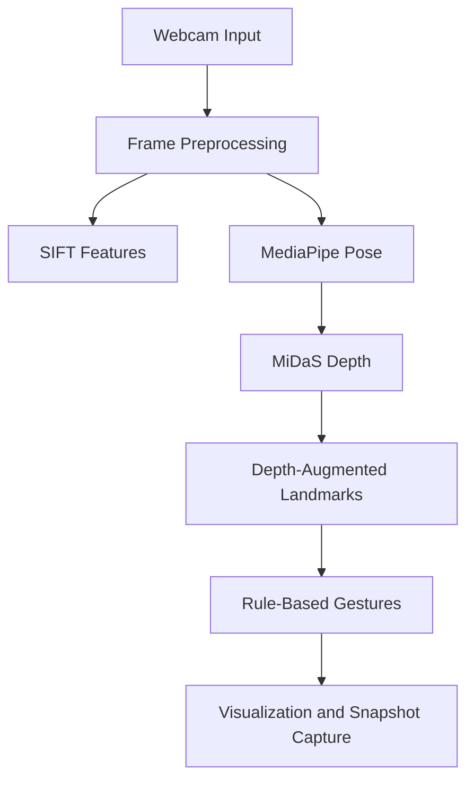

# Pose Estimation for Human-Computer Interaction

Real-time human pose estimation, monocular depth inference, and rule-based gesture recognition using MediaPipe, MiDaS, OpenCV, SIFT, and PyTorch.

## Overview

The project combines:

- MediaPipe Pose for 2D body landmarks
- MiDaS Small for monocular depth estimation
- SIFT for classical feature detection
- Rule-based gesture recognition for hands-up, T-pose, hands-on-hips, and directional pointing
- OpenCV controls for brightness, contrast, low-light simulation, occlusion, visualization, and snapshot capture

`Task_1.py` provides a lightweight real-time 2D pose demo. `Task_2.py` runs the full pose + depth + SIFT + gesture pipeline.

## Architecture



## Tech Stack

- Python
- OpenCV
- MediaPipe
- PyTorch / Torch Hub
- MiDaS
- NumPy
- SIFT

## Installation

Python 3.10 is recommended.

```bash
git clone https://github.com/Azlaan20/Computer_Vision_Project.git
cd Computer_Vision_Project
python -m venv .venv
```

Activate the environment, then install dependencies:

```bash
pip install opencv-python mediapipe torch torchvision numpy
```

A webcam is required to run the demos. MiDaS weights are downloaded through Torch Hub when the full pipeline starts for the first time.

## Usage

Fast 2D pose mode:

```bash
python Task_1.py
```

Full pose/depth/gesture pipeline:

```bash
python Task_2.py
```

Full-pipeline controls:

- `q` — quit
- `l` — toggle simulated low light
- `o` — toggle simulated occlusion
- OpenCV trackbars — adjust brightness and contrast

## Repository Structure

```text
Computer_Vision_Project/
├── Task_1.py               # Lightweight MediaPipe pose demo
├── Task_2.py               # Pose + MiDaS + SIFT + gesture pipeline
├── clean_midas_cache.py    # Optional explicit MiDaS cache cleanup utility
├── Project_Report.docx
├── Project_Report.pdf
├── Project_Statement.pdf
└── README.md
```

## Outputs

The full pipeline can save example frames when conditions such as complete landmark detection, gesture detection, or brightness/contrast limits are reached. Existing result images in the repository show representative outputs.

## Notes on Evaluation

The repository reports real-time FPS and counts detected MediaPipe landmarks and SIFT features during execution. Performance depends strongly on CPU/GPU hardware, camera resolution, lighting, and whether MiDaS inference runs on CPU or CUDA.

The qualitative MediaPipe-vs-SIFT comparison should be interpreted as a demonstration of two different feature paradigms rather than a controlled accuracy benchmark: MediaPipe estimates semantic body landmarks, whereas SIFT detects generic local image features.

## Safety and Side Effects

The pose scripts only access the webcam, process frames, and optionally save output images. They do not terminate unrelated applications, delete temporary directories, or empty the operating system recycle bin. The separate `clean_midas_cache.py` utility performs cache deletion only when explicitly run by the user.

## References

- MediaPipe Pose
- MiDaS
- OpenCV
- D. Lowe, SIFT
- PyTorch Hub

## Academic Context

Developed as part of the CS-474 Computer Vision course at NUST College of EME, Islamabad.
